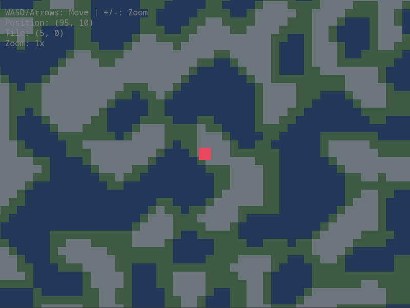

# Emergence Engine

A web-based 2D game engine for simulation games. Code-first, browser-native, minimal by design.

**This is a standalone engine.** Clone it, extend it, build your own games. We're building [Colony](docs/plans/mvp/design.md#target-game-colony) (a RimWorld-like) to prove it works.



## Features

- **Game Loop** — Fixed timestep simulation (20 ticks/sec) with variable rendering
- **ECS** — Entity-Component-System with generational entity IDs
- **Input** — Keyboard polling with press/release/held detection
- **Camera** — World-to-screen transforms, discrete zoom levels, viewport culling
- **TileMap** — Terrain and building layers with center-origin coordinates
- **Terrain Generation** — Simplex noise-based procedural generation
- **Renderer** — Canvas 2D with world-space and screen-space drawing

## Quick Start

```bash
npm install
npm run dev
# Open http://localhost:5173
```

## Usage

```typescript
import { Engine, generateTerrain } from './engine';

const canvas = document.getElementById('game') as HTMLCanvasElement;
const engine = new Engine({ canvas, tickRate: 20 });

// Define terrain types
engine.tileMap.defineTerrain('grass', { color: '#3a5a40', walkable: true });
engine.tileMap.defineTerrain('water', { color: '#1d3557', walkable: false });

// Generate world
generateTerrain(engine.tileMap, { width: 64, height: 64, seed: 12345 });

// Define components
engine.ecs.defineComponent('Position', { x: 0, y: 0 });
engine.ecs.defineComponent('Velocity', { x: 0, y: 0 });

// Create entities
const player = engine.ecs.createEntity();
engine.ecs.addComponent(player, 'Position', { x: 0, y: 0 });
engine.ecs.addComponent(player, 'Velocity');

// Add systems (run every tick automatically)
engine.ecs.addSystem({
  name: 'Movement',
  query: ['Position', 'Velocity'],
  update(entities, dt) {
    for (const e of entities) {
      const pos = engine.ecs.getComponent(e, 'Position');
      const vel = engine.ecs.getComponent(e, 'Velocity');
      pos.x += vel.x * dt;
      pos.y += vel.y * dt;
    }
  },
});

// Render loop
engine.onDraw(() => {
  engine.renderer.clear();
  engine.renderer.drawTileMap(engine.tileMap, 16);

  // Draw entities, UI, etc.
});

engine.start();
```

## API Overview

### Engine

```typescript
const engine = new Engine({ canvas, tickRate: 20 });

engine.ecs        // ECS World
engine.input      // Input system
engine.renderer   // Canvas renderer
engine.camera     // Camera (via renderer)
engine.tileMap    // Tile map

engine.start()           // Start game loop
engine.stop()            // Stop game loop
engine.setSpeed(2)       // 2x speed (0 = paused)
engine.onDraw(() => {})  // Render callback
```

### ECS

```typescript
engine.ecs.defineComponent('Health', { current: 100, max: 100 });

const entity = engine.ecs.createEntity();
engine.ecs.addComponent(entity, 'Health', { current: 50 });
engine.ecs.getComponent(entity, 'Health');  // { current: 50, max: 100 }
engine.ecs.hasComponent(entity, 'Health');  // true
engine.ecs.removeComponent(entity, 'Health');
engine.ecs.destroyEntity(entity);
engine.ecs.isAlive(entity);  // false (stale reference detection)

engine.ecs.addSystem({ name, query, update(entities, dt) {} });
engine.ecs.removeSystem('name');
engine.ecs.query(['Position', 'Velocity']);  // Manual queries
```

### Input

```typescript
engine.input.isKeyDown('ArrowUp');     // Held this tick
engine.input.isKeyPressed('Space');    // Just pressed this tick
engine.input.isKeyReleased('Escape');  // Just released this tick
```

### Camera

```typescript
engine.camera.centerOn(x, y);          // Center camera on world position
engine.camera.pan(dx, dy);             // Pan camera
engine.camera.zoomIn();                // Discrete zoom: 1x → 2x → 4x
engine.camera.zoomOut();               // Discrete zoom: 4x → 2x → 1x
engine.camera.zoom;                    // Current zoom level

engine.camera.worldToScreen(x, y);     // Convert coordinates
engine.camera.screenToWorld(x, y);
engine.camera.worldToTile(x, y, tileSize);
engine.camera.getVisibleBounds(tileSize);  // For culling
```

### TileMap

```typescript
engine.tileMap.defineTerrain('stone', { color: '#666', walkable: true });
engine.tileMap.defineBuilding('wall', { color: '#333', solid: true });

engine.tileMap.create(64, 64, 'grass');  // Create map with default terrain
engine.tileMap.setTerrain(x, y, 'stone');
engine.tileMap.getTerrain(x, y);         // TerrainDef | undefined
engine.tileMap.setBuilding(x, y, 'wall');
engine.tileMap.clearBuilding(x, y);
engine.tileMap.isWalkable(x, y);         // Checks terrain + building
engine.tileMap.isInBounds(x, y);

// Note: (0,0) is map center, not top-left
```

### Renderer

```typescript
engine.renderer.clear('#1a1a2e');
engine.renderer.drawTileMap(tileMap, tileSize);

// World-space (affected by camera)
engine.renderer.drawRect(x, y, w, h, color);
engine.renderer.drawRectCentered(x, y, w, h, color);
engine.renderer.drawCircle(x, y, radius, color);

// Screen-space (fixed position, for UI)
engine.renderer.drawRectScreen(x, y, w, h, color);
engine.renderer.drawTextScreen(text, x, y, { font, color, align });
```

## Scripts

| Command | Description |
|---------|-------------|
| `npm run dev` | Start development server |
| `npm run build` | TypeScript check + production build |
| `npm test` | Run tests |
| `npm run test:watch` | Tests in watch mode |
| `npm run test:coverage` | Tests with coverage report |

## Architecture

```
src/
├── engine/                 # Core engine (importable API)
│   ├── core/
│   │   └── GameLoop.ts     # Fixed timestep loop
│   ├── ecs/
│   │   └── World.ts        # Entity-Component-System
│   ├── input/
│   │   └── Input.ts        # Keyboard polling
│   ├── render/
│   │   ├── Renderer.ts     # Canvas 2D primitives
│   │   └── Camera.ts       # View transforms
│   ├── world/
│   │   ├── TileMap.ts      # Terrain + building layers
│   │   ├── generate.ts     # Terrain generation
│   │   └── noise.ts        # Simplex noise
│   ├── Engine.ts           # Unified entry point
│   └── index.ts            # Public exports
└── main.ts                 # Demo application
```

## Roadmap

- [x] Phase 1: Proof of Life — Game loop, input, renderer
- [x] Phase 2: ECS Foundation — Entity-Component-System
- [x] Phase 3: World — TileMap, Camera, terrain generation
- [ ] Phase 4: Pawns — Pathfinding, needs system
- [ ] Phase 5: AI — Utility AI framework
- [ ] Phase 6: Factions — Multiple colonies, trade

## License

GPL-3.0 — See [LICENSE](LICENSE) for details.

The engine stays free forever. Build what you want.
